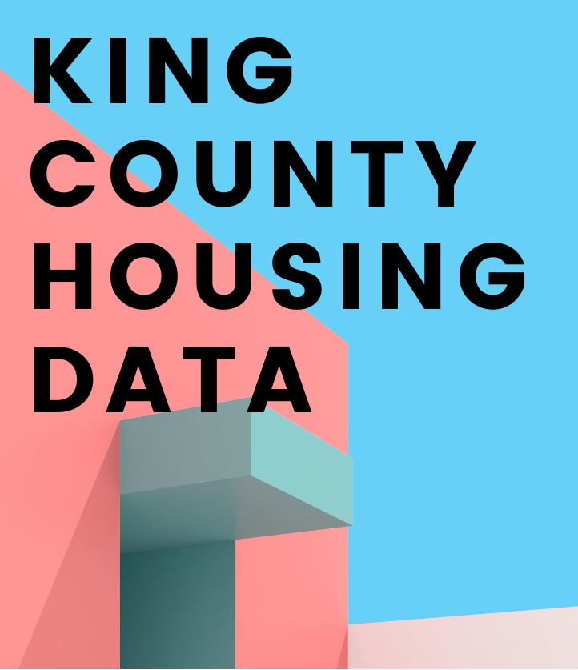

## Executive Summary

This data analytics project offers strategic insights and actionable recommendations for real estate investments in King County, USA. Through a comprehensive analysis of housing data, we have identified key factors that influence property prices, including location, property size, condition, and timing. Leveraging these insights, we have developed targeted strategies for our client, William Rodriguez, who seeks to optimize investment by purchasing two properties for himself and his wife: one in an urban area and one in the countryside.

For the city property, William’s priority is a centrally located, ready-to-move-in home. For the countryside property, he is targeting a non-renovated home with the goal of purchasing at the optimal time.

(Note: William Rodriguez is a fictional client; any resemblance to actual persons is purely coincidental.)

Our key findings suggest that purchasing smaller, well-maintained homes in centrally located city areas, and non-renovated properties in desirable suburban areas during the winter, can lead to significant cost savings. 

We recommend setting aside a total budget of $665,000 for the two properties, with additional funds allocated for renovating the countryside home. These recommendations have been validated through analysis of average house prices across various zip codes, demonstrating their effectiveness across different regions.

## Table of Contents

1. [Introduction](#introduction)
2. [Project Structure](#project-structure)
3. [Installation](#installation)
4. [Usage](#usage)
5. [Results and Insights](#results-and-insights)
6. [Final Recommendations](#final-recommendations)
7. [License](#license)
8. [Acknowledgments](#acknowledgments)

## Introduction

The King County Housing Data Analysis project is designed to assist in making informed real estate investment decisions. Through detailed analysis of housing data, the project identifies key factors that influence property prices and availability, providing actionable recommendations tailored to specific investment strategies.

This project is particularly useful for real estate investors, data analysts, and professionals in the housing market who seek to leverage data-driven insights for better decision-making.

## Project Structure

The project is organized into the following Jupyter notebooks:

1. **01_data_collection.ipynb**: Collects and compiles the necessary dataset for the project.
2. **02_data_cleaning_and_preprocessing.ipynb**: Prepares the data by cleaning and transforming it into a suitable format for analysis.
3. **03_exploratory_data_analysis.ipynb**: Conducts exploratory data analysis to uncover trends and patterns in the data.
4. **04_hypothesis_analysis_and_insights.ipynb**: Tests hypotheses and answers key business questions related to real estate investment.
5. **05_final_Recommendations_and_strategy.ipynb**: Summarizes the findings and provides final recommendations for the client.

## Installation

To run this project locally, follow these steps:

1. **Clone the repository:**

   ```bash
   git clone https://github.com/your-username/king-county-housing-analysis.git
   cd king-county-housing-analysis
   ```

2. **Create and activate a virtual environment (optional but recommended):**

   ```bash
   python -m venv myenv
   source myenv/bin/activate  # On Windows: myenv\Scripts\activate
   ```

3. **Install the required dependencies:**

   ```bash
   pip install -r requirements.txt
   ```

4. **Launch Jupyter Notebook:**

   ```bash
   jupyter notebook
   ```

## Usage

### Running the Analysis

1. **Data Collection**: Start with `01_data_collection.ipynb` to gather the necessary data from the specified sources.
2. **Data Cleaning and Preprocessing**: Use `02_data_cleaning_and_preprocessing.ipynb` to clean and prepare the data.
3. **Exploratory Data Analysis**: Run `03_exploratory_data_analysis.ipynb` to explore the data and uncover insights.
4. **Hypothesis Testing**: Test key hypotheses using `04_hypothesis_testing_and_insights.ipynb`.
5. **Final Recommendations**: Review the final strategic recommendations in `05_final_Recommendations_and_strategy.ipynb`.

### Streamlit Dashboard

A Streamlit dashboard can be run using the provided `app.py` file to visualize and interact with the analysis:

```bash
streamlit run app.py
```

## Results and Insights

The analysis provides key insights into the King County housing market, including:

- The impact of location on property prices.
- The correlation between property size and value.
- The effect of property condition and renovation on market prices.
- Optimal timing for purchasing properties in different areas.

These insights are used to formulate strategic recommendations that can guide real estate investments.

## Final Recommendations

Based on the analysis, we recommend setting aside a budget of $665,000 for the purchase of two properties, one in the city and one in the countryside, with additional funds for renovation costs. These recommendations are validated against average house prices across various zip codes and are shown to perform exceptionally well in all areas.

## License

This project is licensed under the MIT License.

## Acknowledgments

Special thanks to NeueFische GmbH for providing the dataset hosted on their AWS server, and to the contributors and the open-source community for their invaluable tools and resources, which made this project possible.
